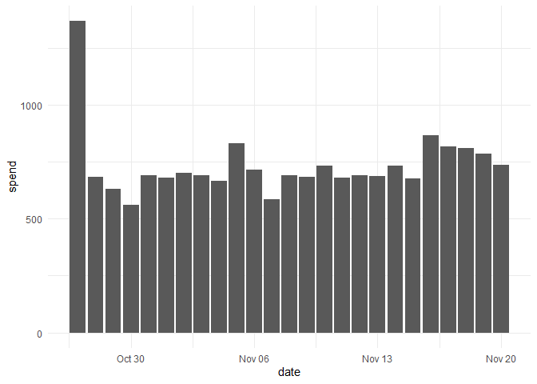

# metatargetr 

<!-- README.md is generated from README.Rmd. Please edit that file -->
<!-- badges: start -->

[](https://lifecycle.r-lib.org/articles/stages.html#experimental)
[](https://CRAN.R-project.org/package=metatargetr)
<!-- badges: end -->

The goal of `metatargetr` is to parse targeting information from the
[Meta Ad Targeting
dataset](https://developers.facebook.com/docs/fort-ads-targeting-dataset/)
as well as retrieve data from the [Audience
tab](https://www.facebook.com/ads/library/?active_status=all&ad_type=political_and_issue_ads&country=NL&view_all_page_id=175740570505&sort_data%5Bdirection%5D=desc&sort_data%5Bmode%5D=relevancy_monthly_grouped&search_type=page&media_type=all)
in the Meta Ad Library. It also includes some helper functions to work
with Meta ad library data in general. Finally, it has also been enhanced
with some data to interact with the Google Transparency Report.

## Installation

You can install the development version of metatargetr like so:

``` r
remotes::install_github("favstats/metatargetr")
```

## Load in Package

``` r
library(metatargetr)
```

## Get Targeting criteria (Last 30 Days)

The following code retrieves the targeting criteria used by the main
page of the VVD (Dutch party) in the last 30 days. Just put in the right
Page ID.

``` r

last30 <- get_targeting("121264564551002", timeframe = "LAST_30_DAYS")

head(last30, 5)
#> # A tibble: 5 × 15
#>   value  num_ads total_spend_pct type  location_type num_obfuscated is_exclusion
#>   <chr>    <int>           <dbl> <chr> <chr>                  <int> <lgl>       
#> 1 All        429          1      gend… <NA>                      NA NA          
#> 2 Women        0          0      gend… <NA>                      NA NA          
#> 3 Men          0          0      gend… <NA>                      NA NA          
#> 4 4381,…      50          0.0858 loca… zips                       0 FALSE       
#> 5 1483,…      53          0.138  loca… zips                       0 FALSE       
#> # ℹ 8 more variables: custom_audience_type <chr>, ds <chr>,
#> #   main_currency <chr>, total_num_ads <int>, total_spend_formatted <chr>,
#> #   is_30_day_available <lgl>, is_90_day_available <lgl>, internal_id <chr>
```

## Get Targeting criteria (Last 7 Days)

The following code retrieves the targeting criteria used by the main
page of the VVD (Dutch party) in the last 7 days. Just put in the right
Page ID.

``` r
last7 <- get_targeting("121264564551002", timeframe = "LAST_7_DAYS")


head(last7, 5)
#> # A tibble: 5 × 15
#>   value  num_ads total_spend_pct type  location_type num_obfuscated is_exclusion
#>   <chr>    <int>           <dbl> <chr> <chr>                  <int> <lgl>       
#> 1 All         73          1      gend… <NA>                      NA NA          
#> 2 Women        0          0      gend… <NA>                      NA NA          
#> 3 Men          0          0      gend… <NA>                      NA NA          
#> 4 1735,…       8          0.0803 loca… zips                       0 FALSE       
#> 5 4652,…       8          0.0803 loca… zips                       0 FALSE       
#> # ℹ 8 more variables: custom_audience_type <chr>, ds <chr>,
#> #   main_currency <chr>, total_num_ads <int>, total_spend_formatted <chr>,
#> #   is_30_day_available <lgl>, is_90_day_available <lgl>, internal_id <chr>
```

## Get Images and Videos

The following code downloads the images and videos of a Meta ad. It also
retrieves additional info not present in the Meta Ad Library API
(e.g. `page_like_count` `cta_type` i.e. call to action button). Just put
in the right Ad Archive ID.

It automatically handles duplicate images and videos (of which there are
many) by hashing the images and videos and making sure they are not
saved twice.

This piece of code was created in collaboration with [Philipp
Mendoza](https://www.uva.nl/en/profile/m/e/p.m.mendoza/p.m.mendoza.html).

Note: You will need the
[OpenImageR](https://github.com/mlampros/OpenImageR) R package for
hashing to run!

``` r

get_ad_snapshots("561403598962843", download = T, hashing = T, mediadir = "data/media")
#> # A tibble: 1 × 52
#>   name  ad_creative_id cards         body_translations byline caption   cta_text
#>   <chr>          <dbl> <list>        <lgl>             <lgl>  <chr>     <lgl>   
#> 1 f      6269946734162 <df [2 × 16]> NA                NA     worldmil… NA      
#> # ℹ 45 more variables: dynamic_item_flags <lgl>, dynamic_versions <lgl>,
#> #   edited_snapshots <lgl>, effective_authorization_category <chr>,
#> #   event <lgl>, extra_images <lgl>, extra_links <lgl>, extra_texts <lgl>,
#> #   extra_videos <lgl>, instagram_shopping_products <lgl>,
#> #   display_format <chr>, title <chr>, link_description <chr>, link_url <chr>,
#> #   page_welcome_message <lgl>, images <lgl>, videos <lgl>,
#> #   creation_time <int>, page_id <dbl>, page_name <chr>, …
```

## Google Transparency Report

`ggl_get_spending` is a function in R that queries the Google Ad Library
to retrieve information about advertising spending for a specified
advertiser. It supports a range of countries and can provide either
aggregated data or time-based spending data.

To use `ggl_get_spending`, you need the advertiser’s unique identifier,
the desired date range, and the country code. The function also has an
option to retrieve time-based spending data.

### Retrieve Aggregated Spending Data

Retrieve aggregated spending data for a specific advertiser in the
Netherlands. It returns details like currency, number of ads, ad type
breakdown, advertiser details, and other metrics.

``` r

ggl_get_spending(advertiser_id = "AR18177962546424709121", 
                 start_date = "2023-10-24", 
                 end_date = "2023-11-22",
                 cntry = "NL")
#> # A tibble: 1 × 15
#>   currency spend number_of_ads img_ad_perc img_ad_spend img_type metric
#>   <chr>    <chr> <chr>               <int>        <int>    <int>  <int>
#> 1 EUR      18400 14                      1            1        2      1
#> # ℹ 8 more variables: advertiser_id <chr>, advertiser_name <chr>, cntry <chr>,
#> #   unk1 <int>, unk2 <int>, unk3 <int>, unk4 <chr>, unk5 <chr>
```

### Retrieve Time-Based Spending Data

Retrieve time-based spending data for the same advertiser and country.
If `get_times` is set to `TRUE`, it returns a tibble with date-wise
spending data.

``` r
# Retrieve time-based spending data for the same advertiser and country
timeseries_dat <- ggl_get_spending(advertiser_id = "AR18177962546424709121", 
                                   start_date = "2023-10-24", 
                                   end_date = "2023-11-22", 
                                   cntry = "NL", 
                                   get_times = T)

# Plotting the time-series data
timeseries_dat %>% 
    ggplot2::ggplot(ggplot2::aes(date, spend)) +
    ggplot2::geom_col() +
    ggplot2::theme_minimal()
```


