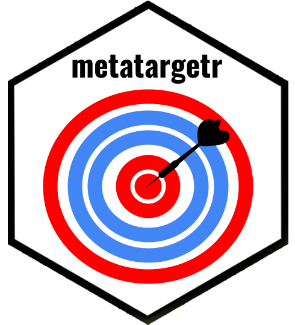

# metatargetr 

<!-- README.md is generated from README.Rmd. Please edit that file -->
<!-- badges: start -->

[](https://lifecycle.r-lib.org/articles/stages.html#experimental)
[](https://CRAN.R-project.org/package=metatargetr)
<!-- badges: end -->

The goal of `metatargetr` is to parse targeting information from the
[Meta Ad Targeting
dataset](https://developers.facebook.com/docs/fort-ads-targeting-dataset/)
as well as retrieve data from the [Audience
tab](https://www.facebook.com/ads/library/?active_status=all&ad_type=political_and_issue_ads&country=NL&view_all_page_id=175740570505&sort_data%5Bdirection%5D=desc&sort_data%5Bmode%5D=relevancy_monthly_grouped&search_type=page&media_type=all)
in the Meta Ad Library.

## Installation

You can install the development version of metatargetr like so:

``` r
remotes::install_github("favstats/metatargetr")
```

## Load in Package

``` r
library(metatargetr)
#> 
#> Attaching package: 'metatargetr'
#> The following object is masked _by_ '.GlobalEnv':
#> 
#>     get_targeting
```

## Get Targeting criteria (Last 30 Days)

The following code retrieves the targeting criteria used by the main
page of the VVD (Dutch party) in the last 30 days. Just put in the right
Page ID.

``` r

last30<- get_targeting("121264564551002", timeframe = "LAST_30_DAYS")

head(last30, 10)
#> # A tibble: 10 × 16
#>    value     num_ads total…¹ type  locat…² num_o…³ is_ex…⁴ custo…⁵ detai…⁶ ds   
#>    <chr>       <int>   <dbl> <chr> <chr>     <int> <lgl>   <chr>   <chr>   <chr>
#>  1 All             7       1 gend… <NA>         NA NA      <NA>    <NA>    2023…
#>  2 Women           0       0 gend… <NA>         NA NA      <NA>    <NA>    2023…
#>  3 Men             0       0 gend… <NA>         NA NA      <NA>    <NA>    2023…
#>  4 Netherla…       7       1 loca… countr…       0 FALSE   <NA>    <NA>    2023…
#>  5 13              0       0 age   <NA>         NA NA      <NA>    <NA>    2023…
#>  6 14              0       0 age   <NA>         NA NA      <NA>    <NA>    2023…
#>  7 15              0       0 age   <NA>         NA NA      <NA>    <NA>    2023…
#>  8 16              0       0 age   <NA>         NA NA      <NA>    <NA>    2023…
#>  9 17              0       0 age   <NA>         NA NA      <NA>    <NA>    2023…
#> 10 18              7       1 age   <NA>         NA NA      <NA>    <NA>    2023…
#> # … with 6 more variables: main_currency <chr>, total_num_ads <int>,
#> #   total_spend_formatted <chr>, is_30_day_available <lgl>,
#> #   is_90_day_available <lgl>, internal_id <chr>, and abbreviated variable
#> #   names ¹​total_spend_pct, ²​location_type, ³​num_obfuscated, ⁴​is_exclusion,
#> #   ⁵​custom_audience_type, ⁶​detailed_type
```

## Get Targeting criteria (Last 7 Days)

The following code retrieves the targeting criteria used by the main
page of the VVD (Dutch party) in the last 7 days. Just put in the right
Page ID.

``` r
last7 <- get_targeting("121264564551002", timeframe = "LAST_7_DAYS")


head(last7, 10)
#> # A tibble: 10 × 16
#>    value     num_ads total…¹ type  locat…² num_o…³ is_ex…⁴ custo…⁵ detai…⁶ ds   
#>    <chr>       <int>   <dbl> <chr> <chr>     <int> <lgl>   <chr>   <chr>   <chr>
#>  1 All             6       1 gend… <NA>         NA NA      <NA>    <NA>    2023…
#>  2 Women           0       0 gend… <NA>         NA NA      <NA>    <NA>    2023…
#>  3 Men             0       0 gend… <NA>         NA NA      <NA>    <NA>    2023…
#>  4 Netherla…       6       1 loca… countr…       0 FALSE   <NA>    <NA>    2023…
#>  5 13              0       0 age   <NA>         NA NA      <NA>    <NA>    2023…
#>  6 14              0       0 age   <NA>         NA NA      <NA>    <NA>    2023…
#>  7 15              0       0 age   <NA>         NA NA      <NA>    <NA>    2023…
#>  8 16              0       0 age   <NA>         NA NA      <NA>    <NA>    2023…
#>  9 17              0       0 age   <NA>         NA NA      <NA>    <NA>    2023…
#> 10 18              6       1 age   <NA>         NA NA      <NA>    <NA>    2023…
#> # … with 6 more variables: main_currency <chr>, total_num_ads <int>,
#> #   total_spend_formatted <chr>, is_30_day_available <lgl>,
#> #   is_90_day_available <lgl>, internal_id <chr>, and abbreviated variable
#> #   names ¹​total_spend_pct, ²​location_type, ³​num_obfuscated, ⁴​is_exclusion,
#> #   ⁵​custom_audience_type, ⁶​detailed_type
```
