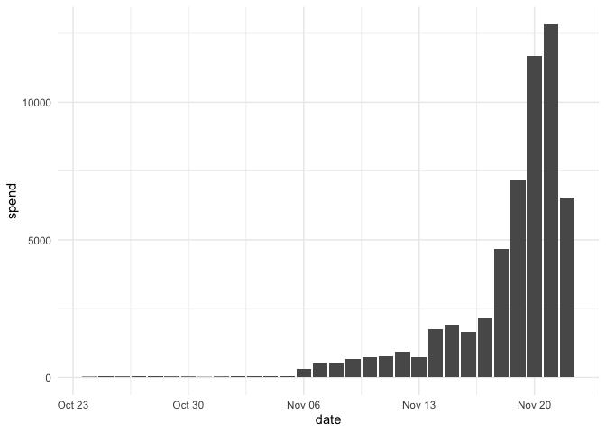

# metatargetr 

<!-- README.md is generated from README.Rmd. Please edit that file -->
<!-- badges: start -->

[](https://lifecycle.r-lib.org/articles/stages.html#maturing)
[](https://CRAN.R-project.org/package=metatargetr)
<!-- badges: end -->

The goal of `metatargetr` is to parse targeting information from the
[Meta Ad Targeting
dataset](https://developers.facebook.com/docs/fort-ads-targeting-dataset/)
as well as retrieve data from the [Audience
tab](https://www.facebook.com/ads/library/?active_status=all&ad_type=political_and_issue_ads&country=NL&view_all_page_id=175740570505&sort_data%5Bdirection%5D=desc&sort_data%5Bmode%5D=relevancy_monthly_grouped&search_type=page&media_type=all)
in the Meta Ad Library. It also includes some helper functions to work
with Meta ad library data in general. Finally, it has also been enhanced
with some data to interact with the Google Transparency Report.

## Installation

You can install the development version of metatargetr like so:

``` r
remotes::install_github("favstats/metatargetr")
```

## Load in Package

``` r
library(metatargetr)
```

## Get Targeting Criteria (Last 30 Days)

The following code retrieves the targeting criteria used by the main
page of the VVD (Dutch party) in the last 30 days. Just put in the right
Page ID.

``` r

last30 <- get_targeting("121264564551002", timeframe = "LAST_30_DAYS")

head(last30, 5)
#>               value num_ads total_spend_pct     type location_type
#> 1               All      44      1.00000000   gender          <NA>
#> 2             Women       0      0.00000000   gender          <NA>
#> 3               Men       0      0.00000000   gender          <NA>
#> 4 5334, Netherlands       2      0.03319955 location          zips
#> 5 6982, Netherlands       2      0.09145497 location          zips
#>   num_obfuscated is_exclusion custom_audience_type         ds main_currency
#> 1             NA           NA                 <NA> 2024-12-25           EUR
#> 2             NA           NA                 <NA> 2024-12-25           EUR
#> 3             NA           NA                 <NA> 2024-12-25           EUR
#> 4              0        FALSE                 <NA> 2024-12-25           EUR
#> 5              0        FALSE                 <NA> 2024-12-25           EUR
#>   total_num_ads total_spend_formatted is_30_day_available is_90_day_available
#> 1            44                €7,906                TRUE                TRUE
#> 2            44                €7,906                TRUE                TRUE
#> 3            44                €7,906                TRUE                TRUE
#> 4            44                €7,906                TRUE                TRUE
#> 5            44                €7,906                TRUE                TRUE
#>           page_id
#> 1 121264564551002
#> 2 121264564551002
#> 3 121264564551002
#> 4 121264564551002
#> 5 121264564551002
```

## Get Targeting Criteria (Last 7 Days)

The following code retrieves the targeting criteria used by the main
page of the VVD (Dutch party) in the last 7 days. Just put in the right
Page ID.

``` r
last7 <- get_targeting("121264564551002", timeframe = "LAST_7_DAYS")


head(last7, 5)
#> # A tibble: 0 × 7
#> # ℹ 7 variables: ds <chr>, main_currency <chr>, total_num_ads <int>,
#> #   total_spend_formatted <chr>, is_30_day_available <lgl>,
#> #   is_90_day_available <lgl>, page_id <chr>
```

## Retrieve *Historical* Targeting Data from Database

Unfortunately, using `get_targeting` **you can only get the targeting
criteria in the last 7, 30, and 90 days windows**. However, I have set
up scrapers that retrieve the daily targeting data for every single page
in the world that runs advertisements in order to archive this data. You
can use the function below to retrieve this data.

> Be aware: sometimes the scrapers do not work so it is possible that
> data is missing sometimes.

``` r
# # set some parameters
the_cntry <- "DE"
tf <- 30
ds <- "2024-10-25"

# # Call the function
latest_data <- get_targeting_db(the_cntry, tf, ds)

# # Inspect the data
head(latest_data)
#> # A tibble: 6 × 37
#>   internal_id no_data tstamp              page_id  cntry page_name partyfacts_id
#>   <chr>       <lgl>   <dttm>              <chr>    <chr> <chr>     <chr>        
#> 1 <NA>        NA      2024-10-27 19:12:35 7440553… DE    CDU-Frak… 1375         
#> 2 <NA>        NA      2024-10-27 19:12:35 7440553… DE    CDU-Frak… 1375         
#> 3 <NA>        NA      2024-10-27 19:12:35 7440553… DE    CDU-Frak… 1375         
#> 4 <NA>        NA      2024-10-27 19:12:35 7440553… DE    CDU-Frak… 1375         
#> 5 <NA>        NA      2024-10-27 19:12:35 7440553… DE    CDU-Frak… 1375         
#> 6 <NA>        NA      2024-10-27 19:12:35 7440553… DE    CDU-Frak… 1375         
#> # ℹ 30 more variables: sources <chr>, country <chr>, party <chr>,
#> #   left_right <dbl>, tags <glue>, tags_ideology <chr>, disclaimer <chr>,
#> #   amount_spent_eur <chr>, number_of_ads_in_library <chr>, date <chr>,
#> #   path <chr>, tf <chr>, remove_em <lgl>, total_n <int>, amount_spent <dbl>,
#> #   value <chr>, num_ads <int>, total_spend_pct <dbl>, type <chr>,
#> #   location_type <chr>, num_obfuscated <int>, is_exclusion <lgl>, ds <chr>,
#> #   main_currency <chr>, total_num_ads <int>, total_spend_formatted <dbl>, …
```

## Retrieve *Historical* Report Data from the Database

Using `get_report_db`, you can retrieve archived advertising reports for
specific pages, countries, and timeframes. Reports are stored in a
repository and can be downloaded and read directly into R.

> Note: While we strive to keep the archive complete, occasional scraper
> failures may lead to missing data for certain days.

``` r
# # set some parameters
the_cntry <- "DE"
tf <- 30
ds <- "2024-10-25"

# # Call the function
latest_data <- get_report_db(the_cntry, tf, ds)

# # Inspect the data
head(latest_data)
#> # A tibble: 6 × 9
#>   page_id     page_name disclaimer amount_spent_eur number_of_ads_in_lib…¹ date 
#>   <chr>       <chr>     <chr>      <chr>            <chr>                  <chr>
#> 1 2781178155… EU Justi… EU Justic… 296508           28                     2024…
#> 2 1706886445… UNICEF D… UNICEF De… 78283            79                     2024…
#> 3 1891313609… LIQID In… LIQID Inv… 76300            88                     2024…
#> 4 1918513976… VETO – T… VETO - Ti… 71581            218                    2024…
#> 5 23216224900 Plan Int… Plan Inte… 62605            62                     2024…
#> 6 1612732458… Save the… Save the … 59891            195                    2024…
#> # ℹ abbreviated name: ¹​number_of_ads_in_library
#> # ℹ 3 more variables: path <chr>, tf <chr>, cntry <chr>
```

## Get Page Info

You can also retrieve some page info of the page that you are interested
in.

``` r
page_info <- get_page_insights("121264564551002", include_info = "page_info")


str(page_info)
#> 'data.frame':    1 obs. of  20 variables:
#>  $ page_name             : chr "VVD"
#>  $ is_profile_page       : chr "FALSE"
#>  $ page_is_deleted       : chr "FALSE"
#>  $ page_is_restricted    : chr "FALSE"
#>  $ has_blank_ads         : chr "FALSE"
#>  $ hidden_ads            : chr "0"
#>  $ page_profile_uri      : chr "https://facebook.com/VVD"
#>  $ page_id               : chr "121264564551002"
#>  $ page_verification     : chr "BLUE_VERIFIED"
#>  $ entity_type           : chr "PERSON_PROFILE"
#>  $ page_alias            : chr "VVD"
#>  $ likes                 : chr "108141"
#>  $ page_category         : chr "Political party"
#>  $ ig_verification       : chr "TRUE"
#>  $ ig_username           : chr "vvd"
#>  $ ig_followers          : chr "42144"
#>  $ shared_disclaimer_info: chr "[]"
#>  $ about                 : chr "Doe mee en word lid van de VVD! 💙🧡 "
#>  $ event                 : chr "CREATION: 2010-04-23 21:05:02"
#>  $ no_address            : logi TRUE
```

## Get Images and Videos

The following code downloads the images and videos of a Meta ad. It also
retrieves additional info not present in the Meta Ad Library API
(e.g. `page_like_count` `cta_type` i.e. call to action button). Just put
in the right Ad Archive ID.

It automatically handles duplicate images and videos (of which there are
many) by hashing the images and videos and making sure they are not
saved twice.

This piece of code was created in collaboration with [Philipp
Mendoza](https://www.uva.nl/en/profile/m/e/p.m.mendoza/p.m.mendoza.html).

``` r

get_ad_snapshots("561403598962843", download = T, hashing = T, mediadir = "data/media")
#> # A tibble: 1 × 52
#>   name  ad_creative_id cards         body_translations byline caption   cta_text
#>   <chr>          <dbl> <list>        <lgl>             <lgl>  <chr>     <lgl>   
#> 1 f      6269946734162 <df [2 × 16]> NA                NA     worldmil… NA      
#> # ℹ 45 more variables: dynamic_item_flags <lgl>, dynamic_versions <lgl>,
#> #   edited_snapshots <lgl>, effective_authorization_category <chr>,
#> #   event <lgl>, extra_images <lgl>, extra_links <lgl>, extra_texts <lgl>,
#> #   extra_videos <lgl>, instagram_shopping_products <lgl>,
#> #   display_format <chr>, title <chr>, link_description <chr>, link_url <chr>,
#> #   page_welcome_message <lgl>, images <lgl>, videos <lgl>,
#> #   creation_time <int>, page_id <dbl>, page_name <chr>, …
```

## Google Transparency Report

`ggl_get_spending` is a function in R that queries the Google
Transparency Report to retrieve information about advertising spending
for a specified advertiser. It supports a range of countries and can
provide either aggregated data or time-based spending data.

To use `ggl_get_spending`, you need the advertiser’s unique identifier,
the desired date range, and the country code. The function also has an
option to retrieve time-based spending data.

### Retrieve Aggregated Spending Data

Retrieve aggregated spending data for a specific advertiser in the
Netherlands. It returns details like currency, number of ads, ad type
breakdown, advertiser details, and other metrics.

``` r

ggl_get_spending(advertiser_id = "AR18091944865565769729", 
                 start_date = "2023-10-24", 
                 end_date = "2023-11-22",
                 cntry = "NL")
#> # A tibble: 1 × 18
#>   currency spend number_of_ads vid_ad_perc vid_ad_spend vid_type text_ad_perc
#>   <chr>    <chr> <chr>               <dbl>        <dbl>    <int>        <dbl>
#> 1 EUR      56050 160                 0.681        0.479        1        0.319
#> # ℹ 11 more variables: text_ad_spend <dbl>, text_type <int>, metric <int>,
#> #   advertiser_id <chr>, advertiser_name <chr>, cntry <chr>, unk1 <int>,
#> #   unk2 <int>, unk3 <int>, unk4 <chr>, unk5 <chr>
```

### Retrieve Time-Based Spending Data

Retrieve time-based spending data for the same advertiser and country.
If `get_times` is set to `TRUE`, it returns a tibble with date-wise
spending data.

``` r
# Retrieve time-based spending data for the same advertiser and country
timeseries_dat <- ggl_get_spending(advertiser_id = "AR18091944865565769729", 
                                   start_date = "2023-10-24", 
                                   end_date = "2023-11-22", 
                                   cntry = "NL", 
                                   get_times = T)

# Plotting the time-series data
timeseries_dat %>% 
    ggplot2::ggplot(ggplot2::aes(date, spend)) +
    ggplot2::geom_col() +
    ggplot2::theme_minimal()
```


