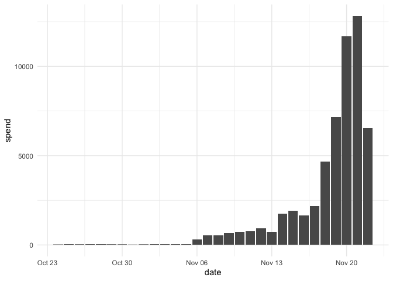

# metatargetr 

The goal of `metatargetr` is to parse targeting information from the
[Meta Ad Targeting
dataset](https://developers.facebook.com/docs/fort-ads-targeting-dataset/)
and retrieve data from the [Audience
tab](https://www.facebook.com/ads/library/?active_status=all&ad_type=political_and_issue_ads&country=NL&view_all_page_id=175740570505&sort_data%5Bdirection%5D=desc&sort_data%5Bmode%5D=relevancy_monthly_grouped&search_type=page&media_type=all)
in the Meta Ad Library. It also includes helper functions for Meta ad
library data and integrates data from the Google Transparency Report.

💡 *Support Open-Source Development*

If `metatargetr` has been helpful to you, consider [supporting the
project](https://www.buymeacoffee.com/favstats)! Every contribution
keeps the maintenance work going and helps me develop new features 😊

[](https://www.buymeacoffee.com/favstats)

------------------------------------------------------------------------

## Table of Contents

- 🚀 [Installation](#installation)  
- 📦 [Load in Package](#load-in-package)  
- 🎯 [Get Targeting Criteria](#get-targeting-criteria)
  - ⏳ [Last 30 Days](#get-targeting-criteria-last-30-days)  
  - 🗓️ [Last 7 Days](#get-targeting-criteria-last-7-days)  
- 🕰️ [Retrieve Historical Targeting
  Data](#retrieve-historical-targeting-data-from-database)  
- 🗂️ [Retrieve Historical Report
  Data](#retrieve-historical-report-data-from-the-database)  
- ℹ️ [Get Page Info](#get-page-info)  
- 🔍 [Retrieve Targeting Metadata](#retrieve-targeting-metadata)  
- 🖼️ [Get Images and Videos](#get-images-and-videos)  
- 📊 [Google Transparency Report](#google-transparency-report)
  - 💰 [Retrieve Aggregated Spending
    Data](#retrieve-aggregated-spending-data)  
  - 📈 [Retrieve Time-Based Spending
    Data](#retrieve-time-based-spending-data)  
- ✍️ [Citing metatargetr](#citing-metatargetr)

------------------------------------------------------------------------

## Installation

You can install the development version of metatargetr like so:

``` r
remotes::install_github("favstats/metatargetr")
```

## Load in Package

``` r
library(metatargetr)
```

## Get Targeting Criteria (Last 30 Days)

The following code retrieves the targeting criteria used by the main
page of the VVD (Dutch party) in the last 30 days of available data.

Just put in the right *Page ID*. These can be found in the [Meta Ad
Library](https://www.facebook.com/ads/library/) or the [Meta Ad Library
Report](https://www.facebook.com/ads/library/report/). You can also
[retrieve historical report
data](#retrieve-historical-report-data-from-the-database) from the
maintained database.

``` r

last30 <- get_targeting(id = "121264564551002", 
                        timeframe = "LAST_30_DAYS")

head(last30, 5)
#>               value num_ads total_spend_pct     type location_type
#> 1               All      44       1.0000000   gender          <NA>
#> 2             Women       0       0.0000000   gender          <NA>
#> 3               Men       0       0.0000000   gender          <NA>
#> 4 5931, Netherlands       7       0.1598496 location          zips
#> 5 9461, Netherlands       7       0.1598496 location          zips
#>   num_obfuscated is_exclusion custom_audience_type         ds main_currency
#> 1             NA           NA                 <NA> 2024-12-26           EUR
#> 2             NA           NA                 <NA> 2024-12-26           EUR
#> 3             NA           NA                 <NA> 2024-12-26           EUR
#> 4              0        FALSE                 <NA> 2024-12-26           EUR
#> 5              0        FALSE                 <NA> 2024-12-26           EUR
#>   total_num_ads total_spend_formatted is_30_day_available is_90_day_available
#> 1            44                €7,606                TRUE                TRUE
#> 2            44                €7,606                TRUE                TRUE
#> 3            44                €7,606                TRUE                TRUE
#> 4            44                €7,606                TRUE                TRUE
#> 5            44                €7,606                TRUE                TRUE
#>           page_id
#> 1 121264564551002
#> 2 121264564551002
#> 3 121264564551002
#> 4 121264564551002
#> 5 121264564551002
```

## Get Targeting Criteria (Last 7 Days)

The following code retrieves the targeting criteria used by the main
page of the VVD (Dutch party) in the last 7 days. Just put in the right
Page ID.

``` r
last7 <- get_targeting(id = "121264564551002", 
                       timeframe = "LAST_7_DAYS")


head(last7, 5)
#> # A tibble: 0 × 7
#> # ℹ 7 variables: ds <chr>, main_currency <chr>, total_num_ads <int>,
#> #   total_spend_formatted <chr>, is_30_day_available <lgl>,
#> #   is_90_day_available <lgl>, page_id <chr>
```

## Retrieve *Historical* Targeting Data from Database

Unfortunately, using `get_targeting` **you can only get the targeting
criteria in the last 7, 30, and 90 days windows**. However, I have set
up scrapers that retrieve the daily targeting data for every single page
in the world that runs advertisements in order to archive this data. You
can use the function below to retrieve it.

> Be aware: sometimes the scrapers do not work so it is possible that
> some pages are missing. You can use
> [`retrieve_targeting_metadata`](#retrieve-targeting-metadata) function
> to check which data for which country and day is present.

``` r
# # set some parameters
the_cntry <- "DE"
tf <- 30
ds <- "2024-10-25"

# # Call the function
latest_data <- get_targeting_db(the_cntry, tf, ds)

# # Inspect the data
head(latest_data)
#> # A tibble: 6 × 37
#>   internal_id no_data tstamp              page_id  cntry page_name partyfacts_id
#>   <chr>       <lgl>   <dttm>              <chr>    <chr> <chr>     <chr>        
#> 1 <NA>        NA      2024-10-27 19:12:35 7440553… DE    CDU-Frak… 1375         
#> 2 <NA>        NA      2024-10-27 19:12:35 7440553… DE    CDU-Frak… 1375         
#> 3 <NA>        NA      2024-10-27 19:12:35 7440553… DE    CDU-Frak… 1375         
#> 4 <NA>        NA      2024-10-27 19:12:35 7440553… DE    CDU-Frak… 1375         
#> 5 <NA>        NA      2024-10-27 19:12:35 7440553… DE    CDU-Frak… 1375         
#> 6 <NA>        NA      2024-10-27 19:12:35 7440553… DE    CDU-Frak… 1375         
#> # ℹ 30 more variables: sources <chr>, country <chr>, party <chr>,
#> #   left_right <dbl>, tags <glue>, tags_ideology <chr>, disclaimer <chr>,
#> #   amount_spent_eur <chr>, number_of_ads_in_library <chr>, date <chr>,
#> #   path <chr>, tf <chr>, remove_em <lgl>, total_n <int>, amount_spent <dbl>,
#> #   value <chr>, num_ads <int>, total_spend_pct <dbl>, type <chr>,
#> #   location_type <chr>, num_obfuscated <int>, is_exclusion <lgl>, ds <chr>,
#> #   main_currency <chr>, total_num_ads <int>, total_spend_formatted <dbl>, …
```

## Retrieve *Historical* Report Data from the Database

Using `get_report_db`, you can retrieve archived advertising reports for
specific pages, countries, and timeframes. Reports are stored in a
repository and can be downloaded and read directly into R.

> Note: While we strive to keep the archive complete, occasional scraper
> failures may lead to missing data for certain days.

``` r
# # set some parameters
the_cntry <- "DE"
tf <- 30
ds <- "2024-10-25"

# # Call the function
latest_data <- get_report_db(the_cntry, tf, ds)

# # Inspect the data
head(latest_data)
#> # A tibble: 6 × 9
#>   page_id     page_name disclaimer amount_spent_eur number_of_ads_in_lib…¹ date 
#>   <chr>       <chr>     <chr>      <chr>            <chr>                  <chr>
#> 1 2781178155… EU Justi… EU Justic… 296508           28                     2024…
#> 2 1706886445… UNICEF D… UNICEF De… 78283            79                     2024…
#> 3 1891313609… LIQID In… LIQID Inv… 76300            88                     2024…
#> 4 1918513976… VETO – T… VETO - Ti… 71581            218                    2024…
#> 5 23216224900 Plan Int… Plan Inte… 62605            62                     2024…
#> 6 1612732458… Save the… Save the … 59891            195                    2024…
#> # ℹ abbreviated name: ¹​number_of_ads_in_library
#> # ℹ 3 more variables: path <chr>, tf <chr>, cntry <chr>
```

## Get Page Info

You can also retrieve some page info of the page that you are interested
in.

``` r
page_info <- get_page_insights("121264564551002", include_info = "page_info")


str(page_info)
#> 'data.frame':    1 obs. of  20 variables:
#>  $ page_name             : chr "VVD"
#>  $ is_profile_page       : chr "FALSE"
#>  $ page_is_deleted       : chr "FALSE"
#>  $ page_is_restricted    : chr "FALSE"
#>  $ has_blank_ads         : chr "FALSE"
#>  $ hidden_ads            : chr "0"
#>  $ page_profile_uri      : chr "https://facebook.com/VVD"
#>  $ page_id               : chr "121264564551002"
#>  $ page_verification     : chr "BLUE_VERIFIED"
#>  $ entity_type           : chr "PERSON_PROFILE"
#>  $ page_alias            : chr "VVD"
#>  $ likes                 : chr "108137"
#>  $ page_category         : chr "Political party"
#>  $ ig_verification       : chr "TRUE"
#>  $ ig_username           : chr "vvd"
#>  $ ig_followers          : chr "42137"
#>  $ shared_disclaimer_info: chr "[]"
#>  $ about                 : chr "Doe mee en word lid van de VVD! 💙🧡 "
#>  $ event                 : chr "CREATION: 2010-04-23 21:05:02"
#>  $ no_address            : logi TRUE
```

## `retrieve_targeting_metadata()`

The `retrieve_targeting_metadata` function is designed to retrieve
metadata about targeting data releases from a GitHub repository to see
which data is present (or not). It extracts and organizes information
such as file names, sizes, timestamps, and tags for a specified country
and timeframe. **This metadata provides an overview of the available
targeting data without downloading the actual files.**

- `country_code` (*Character*):  
  The ISO country code (e.g., `"DE"` for Germany, `"US"` for the United
  States).

- `timeframe` (*Character*):  
  The timeframe for the targeting data. Acceptable values are:

  - `"7"`: Last 7 days.
  - `"30"`: Last 30 days.
  - `"90"`: Last 90 days.

- `base_url` (*Character*, default:
  `"https://github.com/favstats/meta_ad_targeting/releases/expanded_assets/"`):  
  The base URL for the GitHub repository hosting the targeting data.

``` r

# Retrieve metadata for Germany for the last 30 days
metadata <- retrieve_targeting_metadata("DE", "30")

print(metadata)
#> # A tibble: 314 × 3
#>    cntry ds         tframe      
#>    <chr> <chr>      <chr>       
#>  1 DE    2024-12-26 last_30_days
#>  2 DE    2024-12-25 last_30_days
#>  3 DE    2024-12-24 last_30_days
#>  4 DE    2024-12-23 last_30_days
#>  5 DE    2024-12-22 last_30_days
#>  6 DE    2024-12-21 last_30_days
#>  7 DE    2024-12-20 last_30_days
#>  8 DE    2024-12-19 last_30_days
#>  9 DE    2024-12-18 last_30_days
#> 10 DE    2024-12-17 last_30_days
#> # ℹ 304 more rows
```

## Get Images and Videos

The following code downloads the images and videos of a Meta ad. It also
retrieves additional info not present in the Meta Ad Library API
(e.g. `page_like_count` `cta_type` i.e. call to action button). Just put
in the right Ad Archive ID.

It automatically handles duplicate images and videos (of which there are
many) by hashing the images and videos and making sure they are not
saved twice.

This piece of code was created in collaboration with [Philipp
Mendoza](https://www.uva.nl/en/profile/m/e/p.m.mendoza/p.m.mendoza.html).

``` r

get_ad_snapshots("561403598962843", download = T, hashing = T, mediadir = "data/media")
#> # A tibble: 1 × 52
#>   name  ad_creative_id cards         body_translations byline caption   cta_text
#>   <chr>          <dbl> <list>        <lgl>             <lgl>  <chr>     <lgl>   
#> 1 f      6269946734162 <df [2 × 16]> NA                NA     worldmil… NA      
#> # ℹ 45 more variables: dynamic_item_flags <lgl>, dynamic_versions <lgl>,
#> #   edited_snapshots <lgl>, effective_authorization_category <chr>,
#> #   event <lgl>, extra_images <lgl>, extra_links <lgl>, extra_texts <lgl>,
#> #   extra_videos <lgl>, instagram_shopping_products <lgl>,
#> #   display_format <chr>, title <chr>, link_description <chr>, link_url <chr>,
#> #   page_welcome_message <lgl>, images <lgl>, videos <lgl>,
#> #   creation_time <int>, page_id <dbl>, page_name <chr>, …
```

## Google Transparency Report

`ggl_get_spending` is a function in R that queries the Google
Transparency Report to retrieve information about advertising spending
for a specified advertiser. It supports a range of countries and can
provide either aggregated data or time-based spending data.

To use `ggl_get_spending`, you need the advertiser’s unique identifier,
the desired date range, and the country code. The function also has an
option to retrieve time-based spending data.

### Retrieve Aggregated Spending Data

Retrieve aggregated spending data for a specific advertiser in the
Netherlands. It returns details like currency, number of ads, ad type
breakdown, advertiser details, and other metrics.

``` r

ggl_get_spending(advertiser_id = "AR18091944865565769729", 
                 start_date = "2023-10-24", 
                 end_date = "2023-11-22",
                 cntry = "NL")
#> # A tibble: 1 × 18
#>   currency spend number_of_ads text_ad_perc text_ad_spend text_type vid_ad_perc
#>   <chr>    <chr> <chr>                <dbl>         <dbl>     <int>       <dbl>
#> 1 EUR      56050 160                  0.319         0.521         3       0.681
#> # ℹ 11 more variables: vid_ad_spend <dbl>, vid_type <int>, metric <int>,
#> #   advertiser_id <chr>, advertiser_name <chr>, cntry <chr>, unk1 <int>,
#> #   unk2 <int>, unk3 <int>, unk4 <chr>, unk5 <chr>
```

### Retrieve Time-Based Spending Data

Retrieve time-based spending data for the same advertiser and country.
If `get_times` is set to `TRUE`, it returns a tibble with date-wise
spending data.

``` r
# Retrieve time-based spending data for the same advertiser and country
timeseries_dat <- ggl_get_spending(advertiser_id = "AR18091944865565769729", 
                                   start_date = "2023-10-24", 
                                   end_date = "2023-11-22", 
                                   cntry = "NL", 
                                   get_times = T)

# Plotting the time-series data
timeseries_dat %>% 
    ggplot2::ggplot(ggplot2::aes(date, spend)) +
    ggplot2::geom_col() +
    ggplot2::theme_minimal()
```



------------------------------------------------------------------------

## Citing `metatargetr`

If you use the `metatargetr` package or data from its database in your
research, publications, or other outputs, please ensure you provide
proper attribution. This helps recognize the effort and resources
required to maintain and provide access to these data.

### Citation Format

> Votta, Fabio, & Mendoza, Philipp. (2024). `metatargetr`: A package for
> parsing and analyzing ad library and targeting data. GitHub. Available
> at: <https://github.com/favstats/metatargetr>

### BibTeX Entry

``` bibtex
@misc{votta2024metatargetr,
  author = {Votta, Fabio and Mendoza, Philipp},
  title = {metatargetr: A package for parsing and analyzing ad library and targeting data},
  year = {2024},
  publisher = {GitHub},
  url = {https://github.com/favstats/metatargetr}
}
```

### Additional Notes

If you use data from the `metatargetr` database, please include the
following acknowledgement in your work:

> Data were retrieved from the `metatargetr` database, maintained by
> Fabio Votta. The database archives targeting data from the Meta Ad
> Library and Google Transparency Report. For more information, visit
> <https://github.com/favstats/metatargetr>.

By including these citations and acknowledgements, you help support the
continued development of `metatargetr` and its associated resources.
Thank you for your collaboration!

------------------------------------------------------------------------
